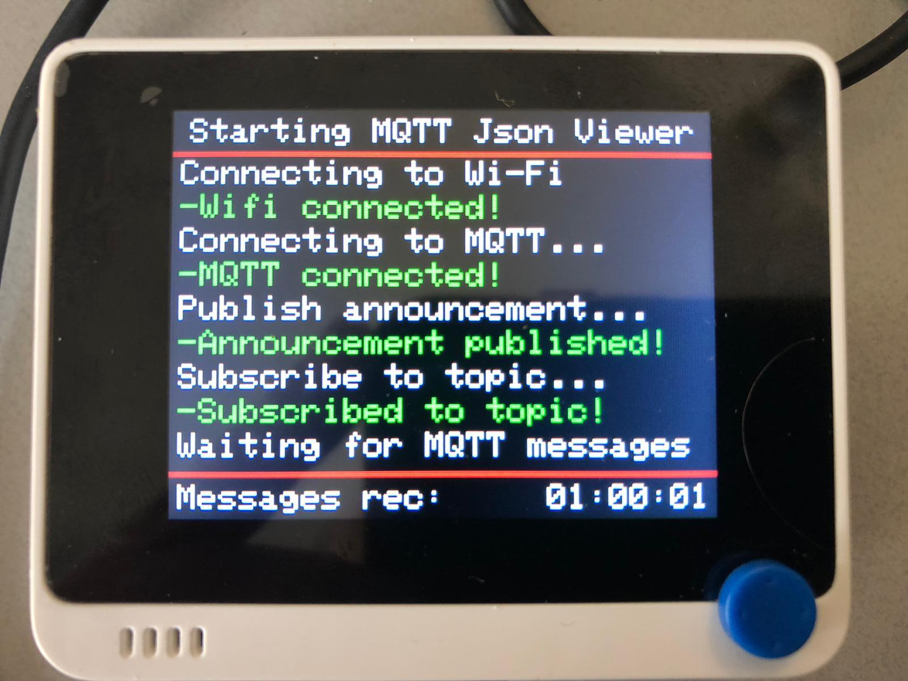
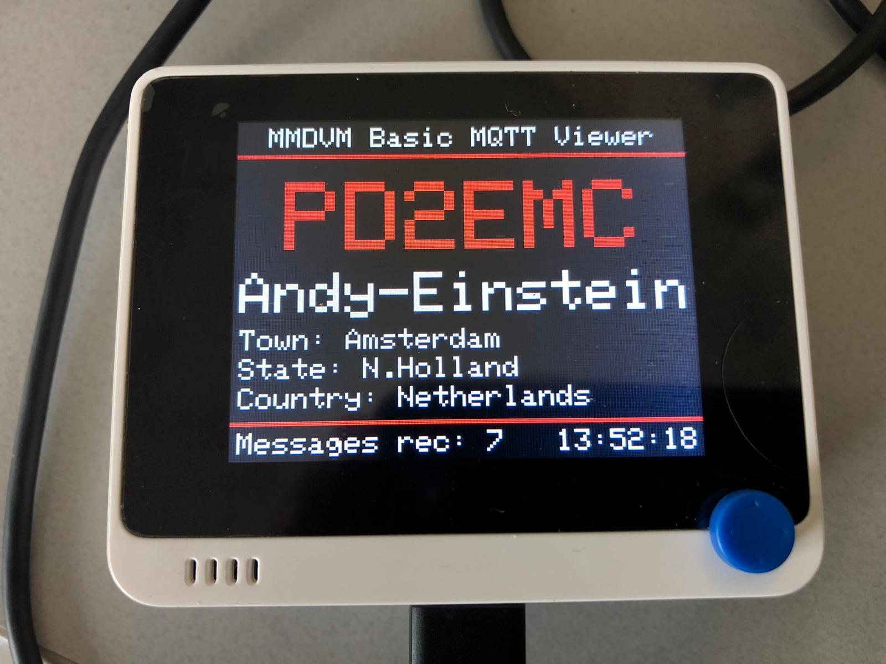
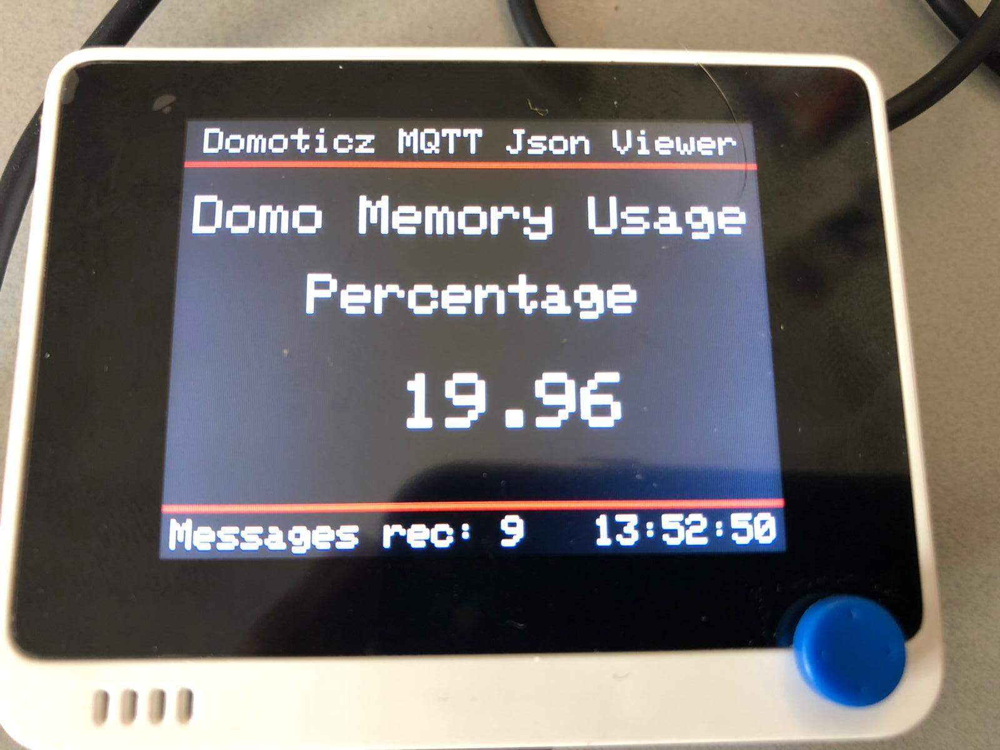

# WioTermial

Wio Terminal MQTT and Json viewer 

 
Simple Usage :  
Use Wio Terminal to see MQTT Data  

  
Basic usage : 
Use Wio Terminal to see lastheard data (mqtt-json) from radioamateur Brandmeister network.(needs monitor and mqttbridge service (added soon)) 
-Getting notified when friend is talking on network. 
 
Extended usage (display all data): 
 
 
Use Wio Terminal to see Domoticz data (mqtt-json) from domoticz/out. 
 

Options during boot: 
-Button A (right):  Escape to ExtFlashLoader Menu 

  
Options after full start: 
-Button A (right):  Escape to ExtFlash Menu 
-Button B (middle): nothing yet (planned to move domoticz here) 
-Button C (left):   Helppage (press again to exit) 
 
-Joystick left : Basic MQTT (plain) output (default) 
-Joystick up   : Nice MQTT output (mqtt contains json output) 
-Joystick right: Extended MQTT output (mqtt contains json output)  
-Joystick down : Domoticz MQTT output (mqtt contains json output)   
 

Thanx to :  
Components added to code: 
-MQTT example 
https://github.com/salmanfarisvp/Wio-Terminal-MQTT 
 
-Json processing (JsonParserExample) 
https://arduinojson.org/v6/example/parser/ 
 
-NTP Timeclient (for timestamps and clock) 
https://github.com/arduino-libraries/NTPClient/tree/master/examples/Advanced 
 
-ExtFlashLoader (for sd menu) 
https://github.com/ciniml/ExtFlashLoader 
 
-alot of code found in other samples,on github and google. 
 
if your name should go here -> tell me. (sorry i forgot you)
