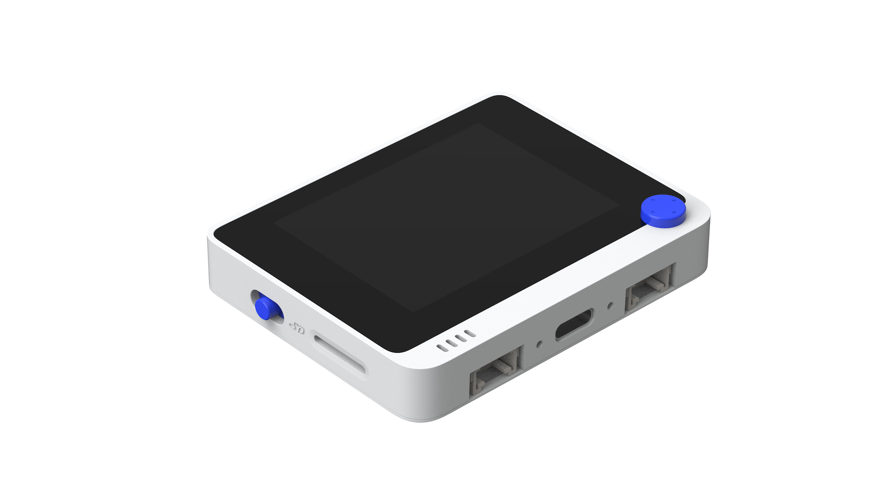

# WioTermial
 

The Wio Terminal is a SAMD51-based microcontroller with Wireless Connectivity powered by Realtek RTL8720DN that’s compatible with Arduino and MicroPython. Currently, wireless connectivity is only supported by Arduino. It runs at 120MHz (Boost up to 200MHz), 4MB External Flash and 192KB RAM. It supports both Bluetooth and Wi-Fi providing backbone for IoT projects. The Wio Terminal itself is equipped with a 2.4” LCD Screen, onboard IMU(LIS3DHTR), Microphone, Buzzer, microSD card slot, Light sensor, and Infrared Emitter(IR 940nm). On top of that, it also has two multifunctional Grove ports for Grove Ecosystem and 40 Raspberry pi compatible pin GPIO for more add-ons.

https://wiki.seeedstudio.com/Wio-Terminal-Getting-Started/

My Projects:

MQTT json Viewer

