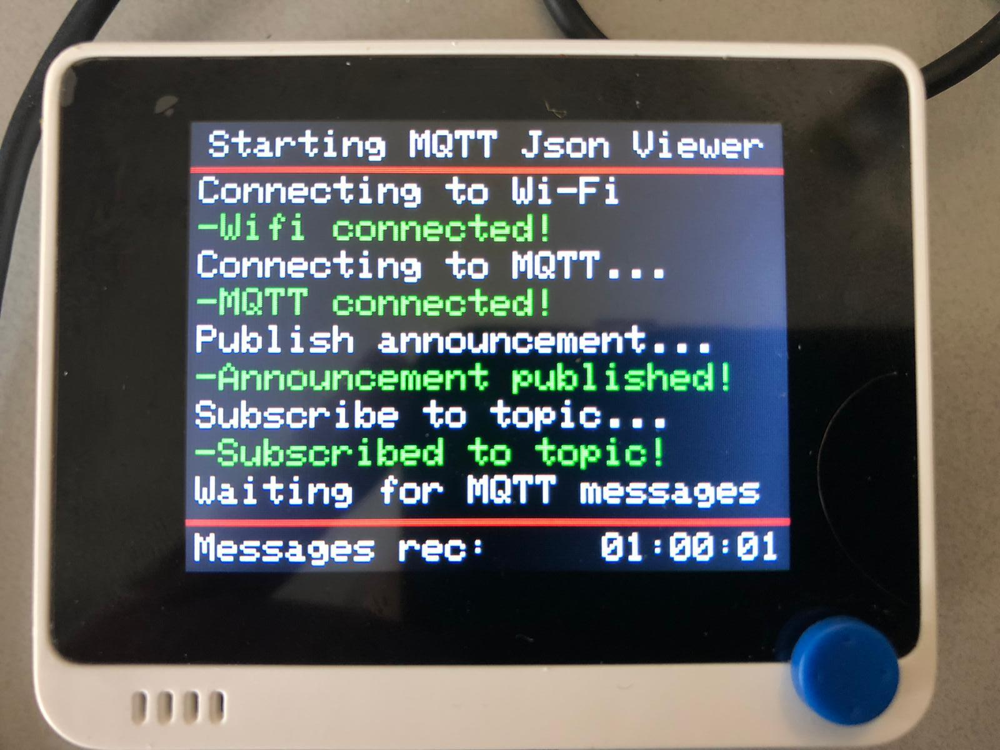

# Wio Terminal MQTT Json viewer	

	
Install Mosquitto MQTT Broker/Server if not done before. 	
http://www.steves-internet-guide.com/install-mosquitto-linux/ 	
  	
Booting Wio Terminal 	
	
  	
Simple display usage :  	
Use Wio Terminal to see MQTT Data  	
- our data is made by monitoring mmdvmhost logfile. 	
	
  	
Basic display usage : 	
Use Wio Terminal to see lastheard data (mqtt-json) from radioamateur Brandmeister network. 	
-<b>This needs monitor and mqttbridge service and a running MMDVMHost instance (Hotspot, Bridge etc)</b> 	
-Getting notified when friend is talking on network (text turns red and wio terminal beeps two times). 	
	
  	
Extended display usage (display all data): 	
 	
  	
Domoticz data display (mqtt-json). 	
-<b>This needs domoticz with mqtt plugin to generate data on domoticz/out</b> 	
 	

	
Options during boot: 	
-Button A (right):  Escape to ExtFlashLoader Menu	
  	
Options after full start: 	
-Button A (right):  Escape to ExtFlash Menu 	
-Button B (middle): nothing yet (planned to move domoticz here) 	
-Button C (left):   Helppage (press again to exit)	
  	
-Joystick left : Basic MQTT (plain) output (default) 	
-Joystick up   : Nice MQTT output (mqtt contains json output) 	
-Joystick right: Extended MQTT output (mqtt contains json output)  	
-Joystick down : Domoticz MQTT output (mqtt contains json output)	
  	

	
Thanx to :  	
Components added to code: 	
-MQTT example 	
https://github.com/salmanfarisvp/Wio-Terminal-MQTT 	
 	
-Json processing (JsonParserExample) 	
https://arduinojson.org/v6/example/parser/ 	
 	
-NTP Timeclient (for timestamps and clock) 	
https://github.com/arduino-libraries/NTPClient/tree/master/examples/Advanced 	
 	
-ExtFlashLoader (for sd menu) 	
https://github.com/ciniml/ExtFlashLoader 	
 	
-alot of code found in other samples,on github and google. 	
 	
if your name should go here -> tell me. (sorry i forgot you)
